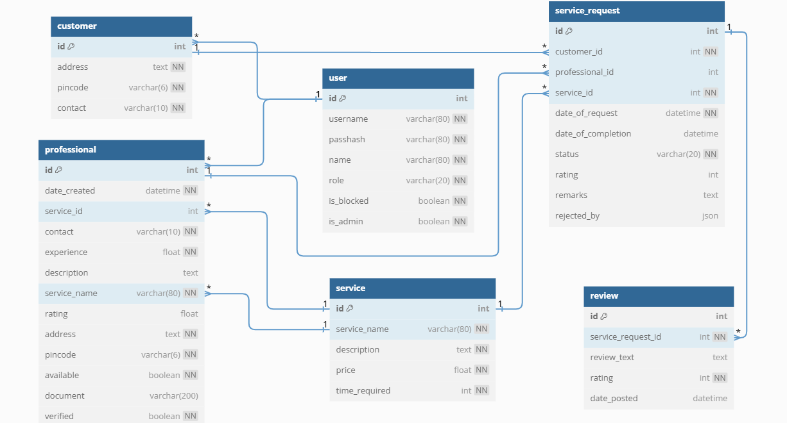

## Description
This is a Household service app where user can register as professional or customer and the Admin 
manages everything like adding/changing services, block/unblock users and see summaries.
## Technologies Used
1. Flask: for request handling, rendering templates, defining views/routes to the application 
2. Flask Sqlalchemy: defining models, doing query operations on the database, committing 
changes to the database.
3. Jinja: for templating, provides more flexibility to the html document.
4. Sqlite: for database tables
## DB Schema Design
The Database has 6 Tables

## Architecture and Features
Following is the recommended flask app structure
1. The app.py contains all the controllers and implements the functionality of the website.
2. models.py contains all the models of tables that is used in the database.
3. Templates folder contains all html files used to serve.
4. The Instance folder has database defined.
Features
1. The flask app opens at main page where user can
a) Register: select wither customer or professional and fill the form . Username should 
not exist in the database
b) Login: Admin/Customer/Professional can Login here. Admin credentials will redirect 
to admin dashboard same for others.
2. Admin:
a. Can add New service or edit existing services.
b. Verify the new login professionals
c. Can block/unblock the customer or professional
d. Search all customer/professional/service requests
e. See the summary
3. Customer:
a. Book Available services 
b. Can closed the booked service
c. See service request history
d. Search all available service
e. See his/her summary
4. Professional:
a. Can accept/reject the available service.
b. If accepted can’t accept another service until first service is closed.
c. Can search all available services.
d. See his/her service summary
[Video](https://drivegooglecomfiled1TOkUVCDmV4GCXlVP06vto_IQ2BRpCoo9view?usp=drive_link)